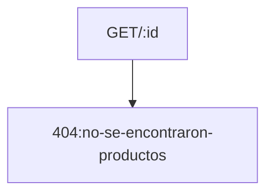
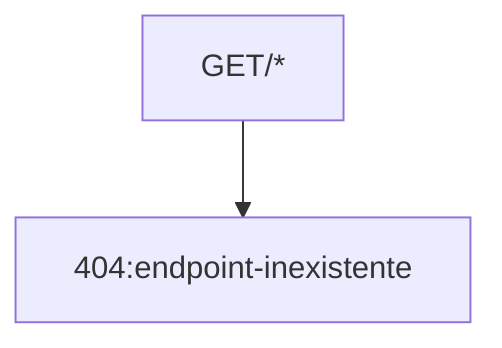
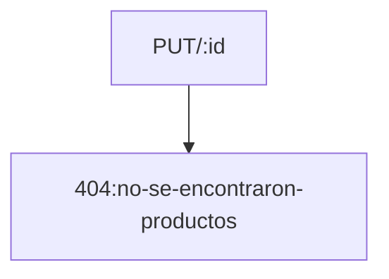

<!-- La misma, deberá incluir los siguientes puntos:
1. Construir una introducción al proyecto backend de frutas:
a. debes detallar al inicio de la documentación la URL base http://localhost:3008/api/v1/
b. deberás crear un ejemplo de uso de cada uno de los métodos GET - POST - PUT - DELETE
c. incluye un ejemplo de código del cuerpo del mensaje para los métodos POST - PUT
d. no incluyas el método PATCH si es que lo construiste oportunamente
e. incluye un ejemplo del archivo .env para explicar cómo definir la conexión a MongoDB
f. no es necesario incluir el nivel de seguridad de la API vía JWT
1. debes integrar en la creación de esta documentación:
a. títulos y subtítulos, más formateo estándar de párrafos con Markdown
b. integrar un sumario en el encabezado del documento Markdown
c. una tabla general que represente los endpoint a utilizar y la ruta base de cada uno
d. utilizar el formato código, para representar los bloques de código de ejemplo
e. al menos un gráfico construído con Markdown, en la sección que consideres apropiada
1. postear todo en Github de forma pública. Compartir el link de acceso a tu trabajo práctico.  -->

# URL BASE
### http//:localhost:3008/
> PORT ----  por defecto 3008 || 3000


# SUMARIO

- [URL BASE](#url-base)
    - [http//:localhost:3008/](#httplocalhost3008)
- [SUMARIO](#sumario)
  - [Introduccion](#introduccion)
  - [EndPoints](#endpoints)
  - [Codigos de PUT y POST](#codigos-de-put-y-post)
  - [Variables de Entorno (.Env)](#variables-de-entorno-env)
  - [Mensajes de Error](#mensajes-de-error)


## Introduccion

Es una API REST de una base de datos de frutas. Proporciona respuestas con recursos en formato JSON. Permite agregar , modificar o eliminar recursos. 

## EndPoints

|PETICION |URL |DESCRIPCION|
--- | --- | ---|
|GET|http://localhost:3008/|ruta raiz . Devuelve todos los productos|
|GET|http://localhost:3008/:id|obtener un producto por su id|
|POST|http://localhost:3008/|crear un nuevo producto|
|PUT|http://localhost:3008/:id|modificar un recurso o agregarlo si no existe
|DELETE|http://localhost:3008/:id|Elimina un producto. Informar el codigo|


Formato de los PRODUCTOS en la Base de Datos :

```json
{
        "id": 10,
        "imagen": "🍒",
        "nombre": "Cereza",
        "importe": 0.9,
        "stock": 14
    }
```


## Codigos de PUT y POST
```javascript
app.put("/:id",(req,res)=>{
  let arrayResultadoPut=[];
  let arrayResultadoAgregar=[];
  let idFrutaAModificar=parseInt(req.params.id); 
  const frutaNueva=req.body;
  function itemIgual(item){return item.id===idFrutaAModificar;} //funcion accesoria para callback
  if(typeof(idFrutaAModificar)==='number'){
    //si existe el producto lo modifico, si no existe lo agrego    
        let resultado=BD.find(itemIgual);
        if(resultado){
          arrayResultadoPut.push(resultado);
          BD.splice(BD.indexOf(resultado),1,frutaNueva);
          guardarFrutas(BD);} 
        else {
          arrayResultadoAgregar.push(req.body);
          BD.push(req.body)
          guardarFrutas(BD)}
      }
        // manejo de errores y resultados
        if(arrayResultadoPut.length>0){
          res.status(200).send(`Se modificaron ${arrayResultadoPut.length} productos con ID ${idFrutaAModificar}`);      
        } else if (arrayResultadoAgregar.length>0){
          res.status(201).send(`Se agregaron ${arrayResultadoAgregar.length} productos con ID ${idFrutaAModificar}`);}
          else{      
          res.status(404).send(`no se encontraron productos`); }    
  })
```

```javascript
app.post("/", (req, res) => {
    const nuevaFruta = req.body;
    BD.push(nuevaFruta);
    guardarFrutas(BD);
    res.status(201).send("Fruta agregada!");
});
```

## Variables de Entorno (.Env)

```javascript
PORT= 3008
DATABASE_PATH=/database/frutas.json
```

>utiliza dep: dotenv y guarda en variable Ej: 
```javascript
const PORT=process.env.PORT;
```

## Mensajes de Error










